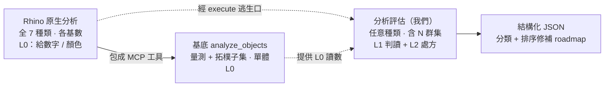

## 分析評估分類學 (Diagnostics Taxonomy)

> **用途**:這是 OceanLab「Rhino 幾何分析評估」專案的版圖。它把 **Rhino 全部原生分析能力**做精準分類,標出哪些基底已覆蓋、哪些是我們要補的格。每新增一項分析評估,就往這張表填一個座標。
> **維護**:新增分析能力 / 新分析評估時更新 §3 主分類表與 §6 roadmap。
> **最後更新**:2026-06-14。
> **相容鐵則**:分析評估只感知不修補;本文件中歸入「修改/修復」的指令我們永不執行(見 §4)。

---

## 1. 一句話模型

- **Rhino 原生分析** = 全種類 × 各基數 × **L0**(給數字/給顏色,不下判斷)
- **基底 `analyze_objects`** = 量測+拓樸子集 × 單體 × L0
- **分析評估(我們)** = 任意種類 × 任意基數(含 **N 群集**)× **L1+L2**(判讀+處方)×(跨幾何型別)

分析評估的本質不是「某一種分析」,而是 **L1/L2 判讀層**——把 Rhino 的「儀器讀數」變成「診斷結論 + 排序修補劇本」。

---

## 2. 分類軸(正交)

每個工具用一組座標定位,避免把不同維度混成扁平清單。

### 軸 1 — 種類 Kind(量「什麼」):7 家族
量測 / 拓樸有效性 / 連續性 / 曲率品質 / 方向 / 偏差吻合 / 位置關係。

### 軸 2 — 基數 Arity(「幾個」一起看)
- **單體 (1)**:一個物件或一個子物件自己。
- **成對 (2)**:兩個實體之間的關係。
- **群集 (N)**:≥3 個互相關聯的實體(邊環、面組、物件集)。← 不是 pair 的延伸,是一等公民。
- 子維度 **層級**:子物件(邊/面/頂點)/ 物件 / 文件。

### 軸 3 — 產出 Output(給「數字」還是給「判斷」)
- **L0 描述**:原始數值 / 顏色 / 視覺(Rhino 原生 + 基底 `analyze_objects`)。
- **L1 判讀**:分類 + 信心(例:這是 `gap` / `misalignment` / `unjoined_coincident`)。
- **L2 處方**:排序修補劇本(例:BlendSrf > Loft > Sweep2,含步驟與驗證點)。

### 維度 — 幾何型別 Geometry type
同一分析在不同型別上行為不同,且子物件拓樸不同:
**Curve / Surface-Polysurface(Brep)/ SubD / Mesh / Extrusion / PointCloud**。
> 重要:SubD 邊有 crease/smooth 概念、Mesh 邊是 topology edge,naked 判定與連續性跟 Brep **不同套**。

---

## 3. 主分類表:7 種類 × 全 Rhino 原生分析指令

> 指令清單已交叉核對 5 個 McNeel 權威頁(見 §7)。✅=基底已包成 MCP 工具;⚪=只能經 `run_command`/`execute_*` 逃生口呼叫(仍 L0);❌=完全沒有。

| # | 種類 Kind | Rhino 原生指令(完整) | 典型基數 | 基底現況 | 分析評估切入(L1/L2) |
|---|---|---|---|---|---|
| 1 | **量測 Metric** | Distance, Length, Angle, Radius, Diameter, Domain, Curvature(點), EvaluatePt, EvaluateUVPt, BoundingBox, MarkFoci, CutVolume, Area, AreaCentroid, AreaMoments, Volume, VolumeCentroid, VolumeMoments, Hydrostatics, DimArea, DimVolume, DimAngle, DimCurveLength | 單體(Distance/Angle/CutVolume 成對) | ✅ `analyze_objects` 覆蓋大半(length/area/volume/centroid/bbox/degree) | 低(數值本身不需判讀) |
| 2 | **拓樸/有效性 Topology** | Check, CheckNewObjects, SelBadObjects, ShowEdges, ShowEnds, PolygonCount, List, What, Audit | 單體 / **文件**(SelBadObjects/Audit 掃全場) | ⚪ 部分:`valid`+`validity_log`+整體 `naked_edge_count`+`is_solid` | **中高**:子物件層級 + 把「壞在哪、怎麼修」轉成 L1/L2 |
| 3 | **連續性 Continuity** | GCon(兩曲線), EdgeContinuity(跨邊兩面) | **成對 / 群集**(邊環、面組) | ❌ | **高**:`diagnose_edge_pair` 的連續性現況就在這 |
| 4 | **曲率/曲面品質 Quality** | CurvatureAnalysis, Curvature, CurvatureGraph, ExtractCurvatureGraph⁽ᵉˣ⁾, DraftAngleAnalysis, DraftAnglePoint, ThicknessAnalysis, Zebra, EMap, Bounce | 單體 / 群集(面組) | ❌ | 中:把 false-color/comb 轉成「最小半徑<刀具」「拔模角不足不可脫模」「壁厚不足」 |
| 5 | **方向/定向 Orientation** | Dir, ShowDir | 單體 / **群集**(多重曲面法線一致性) | ❌ | 中:群集法線一致性是典型 N 元診斷 |
| 6 | **偏差/吻合 Deviation** | CrvDeviation(兩曲線), PointDeviation(點集 vs 面/線) | **成對 / 群集**(點雲 vs 面) | ❌(`GetDistancesBetweenCurves` 未被包成工具) | **高**:gap 量測、逆向工程吻合度 |
| 7 | **位置關係/碰撞 Spatial** | **Clash(兩組 SET)**, IntersectSelf(自交), CutVolume⁽ᵐ⁾, SelDup/SelDupAll⁽ˢᵉˡ⁾ | **成對 / 群集(Clash 多對多)** | ❌ | **高**:碰撞、重合未接、重複物件,全是關係型判讀 |

註:
- **跨家族**:`Zebra`/`EMap` 是反射視覺工具,同時服務 #3 連續性與 #4 曲面品質;`EdgeContinuity` 官方同列於「Analyze object」與「surface quality」,本表歸 #3(數值跨邊 G 連續)。
- ⁽ᵉˣ⁾ `ExtractCurvatureGraph` 會產生曲率梳幾何(extract 性質),分析語意屬 #4。
- ⁽ᵐ⁾ `CutVolume` 同屬 #1 量測(交集體積)。
- ⁽ˢᵉˡ⁾ `SelDup/SelDupAll` 在 Select 選單(選擇型重複偵測),功能上屬 #7。

---

## 4. 排除清單(精準界定:這些不是「分析」)

| 類別 | 指令 | 為何排除 |
|---|---|---|
| 修改 / 修復 | Flip, MeshRepair, Untrim, EndBulge | 會**改幾何**(edit/repair)。Rhino 把它們塞在 Analyze 選單的「Repair」,但本質是動手——**分析評估永不執行**(鐵則 3) |
| 產生 / 抽取 | DupEdge, DupBorder, DupFaceBorder, Silhouette, Contour, Section, ExtractPt, ExtractIsocurve | 會**產生新幾何**供檢視,是 create/extract,不是 analyze |
| 工具 / 計算機 | Calc, CalcRPN, ClearAnalysisMeshes | 非幾何分析(計算機 / 清暫存分析網) |
| 顯示切換 | ShowDirOff, ShowEdgesOff, ShowEndsOff, CurvatureGraphOff, CurvatureAnalysisOff | 顯示狀態開關,非獨立分析 |

---

## 5. 三者定位(座標)

| 對象 | 種類 | 基數 | 產出 | 幾何型別 |
|---|---|---|---|---|
| **Rhino 原生分析指令** | 全 7 家族 | 各基數 | **L0** | 各型別 |
| **基底 `analyze_objects`** | 量測 + 拓樸子集 | 單體(物件層級) | **L0** | Brep/Curve/Mesh/Extrusion/Surface |
| **`diagnose_edge_pair`(第一項分析評估)** | 拓樸 + 連續性 + 偏差 + 位置關係 | **成對 / 子物件** | **L1 + L2** | **目前僅 Brep 邊** |

基底其他唯讀工具(`get_object_info`/`get_selected_objects_info`/`get_document_summary`/`object_attributes`/`capture_viewport`)皆 L0;`execute_*`/`run_command` 可呼叫任何 Rhino 原生分析指令,但回傳仍是 L0 原始文字。

---

## 6. 分析評估 roadmap(用座標展開)

| 分析評估 | 種類 | 基數 | 產出 | 狀態 |
|---|---|---|---|---|
| `diagnose_edge_pair` | 拓樸+連續性+偏差+位置 | 成對 / 子物件 | L1+L2 | **Phase 1 進行中** |
| `diagnose_edge_loop` | 連續性+拓樸 | **群集**(一圈 naked edge) | L1+L2 | 候選 |
| `diagnose_shell_watertight` | 拓樸 | **群集**(面組能否接成水密實體) | L1+L2 | 候選 |
| `diagnose_surfaceset_continuity` | 連續性 | **群集**(多片面 G 連續地圖) | L1+L2 | 候選 |
| `diagnose_normals_consistency` | 方向 | **群集** | L1+L2 | 候選 |
| `diagnose_clash` | 位置關係 | **群集(多對多)** | L1+L2 | 候選(對應 Rhino Clash) |
| `diagnose_manufacturability` | 曲率品質 | 單體 / 群集(最小半徑/拔模角/壁厚) | L1+L2 | 候選(疊在 ThicknessAnalysis/DraftAngle/CurvatureAnalysis 之上) |
| `diagnose_deviation_fit` | 偏差吻合 | 成對 / 群集(點雲 vs 面) | L1+L2 | 候選 |

---

## 7. 來源與完整性邊界

**交叉核對的權威來源(McNeel Rhino 8 help)**:
1. Analyze 總覽 see-also — `seealso/sak_analysis.htm`
2. Analyze 工具列 — `toolbarmap/analyze_toolbar.htm`
3. Mass Properties 工具列 — `toolbarmap/mass_properties_toolbar.htm`
4. Measure — `seealso/sak_measure.htm`
5. New in Rhino 8 — `commandlist/newinrhino8.htm`(確認 R8 無新增分析「類別」,既有分析新增 SubD 支援;新測量指令 DimVolume)

**刻意不納入(非 Rhino 原生「純看不改」指令)**:
- Grasshopper 分析元件、第三方外掛(SectionTools、結構/海洋模組等)
- 自訂 AnalysisMode 顯示管線 / 貼圖式檢視
- 極冷門或後續版本限定指令

> 信心聲明:對 **Rhino 8 原生幾何分析指令**,本表已逐筆核對、邊界案例皆定性,視為完整。上述三類在範圍外,需要時再展開。
