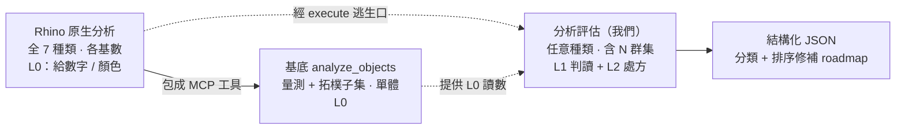

## 分析評估分類學 (Diagnostics Taxonomy)

> 這份是 OceanLab「Rhino 幾何分析評估」專案的底圖:把 Rhino 原生的分析能力全攤開分類,看哪些基底已經有、哪些得我們自己長。每多一項分析評估,就往表裡填一格。
> 維護:加新能力或新項目時,順手更新 §3 的表跟 §6 roadmap。
> 最後更新 2026-06-14。
> 一條底線:分析評估只看不改,§4 那些會動到幾何的指令我們一律不碰。

---

## 1. 一句話模型

- Rhino 原生分析 = 全種類 × 各基數 × L0(給數字、給顏色,不下判斷)
- 基底 analyze_objects = 量測+拓樸的一部分 × 單體 × L0
- 我們的分析評估 = 任意種類 × 任意基數(含 N 群集)× L1+L2(判讀+處方),而且跨幾何型別

說穿了,我們做的不是某一種分析,是上面那層 L1/L2:把 Rhino 的儀器讀數,翻成「這是什麼毛病、該怎麼修」。

---

## 2. 分類軸(正交)

每支工具給一組座標,不要全擠成一張扁平清單。

### 軸 1 — 種類 Kind(量什麼):7 家族
量測 / 拓樸有效性 / 連續性 / 曲率品質 / 方向 / 偏差吻合 / 位置關係。

### 軸 2 — 基數 Arity(幾個一起看)
- 單體 (1):一個物件、或一個子物件自己。
- 成對 (2):兩個實體之間的關係。
- 群集 (N):≥3 個互相關聯的實體(邊環、面組、物件集)。這不是 pair 的延伸,是一等公民。
- 另外帶一個層級:子物件(邊/面/頂點)/ 物件 / 文件。

### 軸 3 — 產出 Output(給數字還是給判斷)
- L0 描述:原始數值、顏色、視覺(Rhino 原生 + 基底 analyze_objects)。
- L1 判讀:分類加信心,像「這是 gap / misalignment / unjoined_coincident」。
- L2 處方:排序過的修補劇本,像 BlendSrf > Loft > Sweep2,含步驟跟驗證點。

### 維度 — 幾何型別
同一個分析,換個型別行為就不一樣,子物件拓樸也不同:
Curve / Surface-Polysurface(Brep)/ SubD / Mesh / Extrusion / PointCloud。
SubD 邊有 crease/smooth、Mesh 邊是 topology edge,naked 判定跟連續性都跟 Brep 不同套,別混。

---

## 3. 主分類表:7 種類 × 全 Rhino 原生分析指令

指令清單對過 5 個 McNeel 官方頁(見 §7)。基底現況欄:✅=已包成 MCP 工具;⚪=只能用 run_command / execute_* 逃生口呼叫,回來還是 L0;❌=沒有。

| # | 種類 Kind | Rhino 原生指令(完整) | 典型基數 | 基底現況 | 分析評估切入(L1/L2) |
|---|---|---|---|---|---|
| 1 | 量測 Metric | Distance, Length, Angle, Radius, Diameter, Domain, Curvature(點), EvaluatePt, EvaluateUVPt, BoundingBox, MarkFoci, CutVolume, Area, AreaCentroid, AreaMoments, Volume, VolumeCentroid, VolumeMoments, Hydrostatics, DimArea, DimVolume, DimAngle, DimCurveLength | 單體(Distance/Angle/CutVolume 成對) | ✅ analyze_objects 覆蓋大半(length/area/volume/centroid/bbox/degree) | 低,數字就是數字 |
| 2 | 拓樸/有效性 Topology | Check, CheckNewObjects, SelBadObjects, ShowEdges, ShowEnds, PolygonCount, List, What, Audit | 單體 / 文件(SelBadObjects、Audit 掃全場) | ⚪ 部分:valid + validity_log + 整體 naked_edge_count + is_solid | 中高,做子物件層級、把「壞在哪、怎麼修」補成 L1/L2 |
| 3 | 連續性 Continuity | GCon(兩曲線), EdgeContinuity(跨邊兩面) | 成對 / 群集(邊環、面組) | ❌ | 高,diagnose_edge_pair 的連續性就在這 |
| 4 | 曲率/曲面品質 Quality | CurvatureAnalysis, Curvature, CurvatureGraph, ExtractCurvatureGraph⁽ᵉˣ⁾, DraftAngleAnalysis, DraftAnglePoint, ThicknessAnalysis, Zebra, EMap, Bounce | 單體 / 群集(面組) | ❌ | 中,把 false-color / comb 翻成「最小半徑<刀具」「拔模不夠脫不了模」「壁太薄」 |
| 5 | 方向/定向 Orientation | Dir, ShowDir | 單體 / 群集(多重曲面法線一致性) | ❌ | 中,整片法線一不一致是典型 N 元診斷 |
| 6 | 偏差/吻合 Deviation | CrvDeviation(兩曲線), PointDeviation(點集 vs 面/線) | 成對 / 群集(點雲 vs 面) | ❌(GetDistancesBetweenCurves 還沒被包成工具) | 高,gap 量測、逆向吻合度 |
| 7 | 位置關係/碰撞 Spatial | Clash(兩組 SET), IntersectSelf(自交), CutVolume⁽ᵐ⁾, SelDup/SelDupAll⁽ˢᵉˡ⁾ | 成對 / 群集(Clash 多對多) | ❌ | 高,碰撞、重合未接、重複,全是看關係 |

幾個歸類沒那麼乾淨的,先講清楚:
- Zebra、EMap 是反射視覺,#3 連續性跟 #4 品質都用得到;EdgeContinuity 官方兩處都列,這裡歸 #3(它是跨邊的數值 G 連續)。
- ⁽ᵉˣ⁾ ExtractCurvatureGraph 會把曲率梳變成幾何(算 extract),但語意是 #4。
- ⁽ᵐ⁾ CutVolume 也算 #1 量測(交集體積)。
- ⁽ˢᵉˡ⁾ SelDup/SelDupAll 在 Select 選單、不在 Analyze,但做的事是 #7。

---

## 3.5 換個軸看:點線面體

§3 按「量什麼」分,這節按「在哪種幾何上量」分,同一批指令重排一次。順便當完整性檢查——每支都歸得進去,沒跑出 §3 以外的東西,兩個軸就對得起來。

**點(點/點雲/座標)**
EvaluatePt(報座標)、Distance(兩點距)、PointDeviation(點雲對面或線的偏差)、MarkFoci(圓錐焦點)。Rhino 這塊幾乎是空的,點雲沒什麼原生判讀,真要做得自己量。

**線(曲線、邊)**
Length、Radius、Diameter、Angle、Domain 量大小;Curvature、CurvatureGraph 看曲率梳;GCon 比兩曲線連續;CrvDeviation 比兩曲線偏差;Dir 看方向;ShowEnds 找開放端;IntersectSelf 抓自交。diagnose_edge_pair 吃的就是這層,邊本質是線,只是掛在面/體上。

**面(曲面、多重曲面)**
Area、AreaCentroid 量面積;CurvatureAnalysis、Zebra、EMap 看曲面品質;DraftAngleAnalysis 看拔模;ThicknessAnalysis 看壁厚;EdgeContinuity 比跨邊兩面連續;Dir 看法線;ShowEdges 抓 naked/non-manifold 邊;再加 EvaluateUVPt、IntersectSelf。

**體(封閉多重曲面)**
Volume、VolumeCentroid、VolumeMoments、Hydrostatics 算質量浮體;CutVolume 算交集體積;ThicknessAnalysis 看壁厚;Check、SelBadObjects 驗有效性;ShowEdges 看 naked 邊是不是 0(這才算真封閉);Clash 抓碰撞。

哪種都吃的:BoundingBox、List、What、Audit、SelDup、Check 那一串。
另外兩種型別:Mesh 有 PolygonCount、ShowEdges、Area、Volume;SubD 從 Rhino 8 起 CurvatureAnalysis、CurvatureGraph、PointDeviation、Volume 也都收了。

按型別看才跳出來的三件事:
- 點雲基本沒得用,要做這塊等於從零。
- 線是我們挖最深的一層,edge_pair 現在、edge_loop 之後都在這。
- 「體到底封了沒」沒有單一指令,得 ShowEdges(naked=0)配 Check 一起看,對應 roadmap 的 shell_watertight。

---

## 4. 這些不算分析(會動到幾何 / 純工具)

| 類別 | 指令 | 為什麼不收 |
|---|---|---|
| 修改 / 修復 | Flip, MeshRepair, Untrim, EndBulge | 會改幾何。Rhino 把它們放在 Analyze 選單的 Repair 底下,但本質是動手——我們一律不碰(鐵則 3) |
| 產生 / 抽取 | DupEdge, DupBorder, DupFaceBorder, Silhouette, Contour, Section, ExtractPt, ExtractIsocurve | 會生出新幾何給你看,是 create/extract,不是看 |
| 工具 / 計算機 | Calc, CalcRPN, ClearAnalysisMeshes | 不是幾何分析(計算機、清暫存分析網) |
| 顯示開關 | ShowDirOff, ShowEdgesOff, ShowEndsOff, CurvatureGraphOff, CurvatureAnalysisOff | 只是顯示切換,不是獨立分析 |

---

## 5. 三者定位(座標)

| 對象 | 種類 | 基數 | 產出 | 幾何型別 |
|---|---|---|---|---|
| Rhino 原生分析指令 | 全 7 家族 | 各基數 | L0 | 各型別 |
| 基底 analyze_objects | 量測 + 拓樸子集 | 單體(物件層級) | L0 | Brep/Curve/Mesh/Extrusion/Surface |
| diagnose_edge_pair(第一項分析評估) | 拓樸 + 連續性 + 偏差 + 位置關係 | 成對 / 子物件 | L1 + L2 | 目前只吃 Brep 邊 |

基底其他唯讀工具(get_object_info、get_selected_objects_info、get_document_summary、object_attributes、capture_viewport)也都是 L0;execute_* / run_command 能呼叫任何 Rhino 原生分析,但回來還是 L0 原始文字。

---

## 6. 分析評估 roadmap(用座標展開)

| 分析評估 | 種類 | 基數 | 產出 | 狀態 |
|---|---|---|---|---|
| `diagnose_edge_pair` | 拓樸+連續性+偏差+位置 | 成對 / 子物件 | L1+L2 | Phase 1 進行中 |
| `diagnose_edge_loop` | 連續性+拓樸 | 群集(一圈 naked edge) | L1+L2 | 候選 |
| `diagnose_shell_watertight` | 拓樸 | 群集(面組能不能接成水密實體) | L1+L2 | 候選 |
| `diagnose_surfaceset_continuity` | 連續性 | 群集(多片面 G 連續地圖) | L1+L2 | 候選 |
| `diagnose_normals_consistency` | 方向 | 群集 | L1+L2 | 候選 |
| `diagnose_clash` | 位置關係 | 群集(多對多) | L1+L2 | 候選(對應 Rhino Clash) |
| `diagnose_manufacturability` | 曲率品質 | 單體 / 群集(最小半徑/拔模角/壁厚) | L1+L2 | 候選(疊在 ThicknessAnalysis/DraftAngle/CurvatureAnalysis 上) |
| `diagnose_deviation_fit` | 偏差吻合 | 成對 / 群集(點雲 vs 面) | L1+L2 | 候選 |

---

## 7. 來源與範圍

對過的官方頁(McNeel Rhino 8 help):
1. Analyze 總覽 see-also — `seealso/sak_analysis.htm`
2. Analyze 工具列 — `toolbarmap/analyze_toolbar.htm`
3. Mass Properties 工具列 — `toolbarmap/mass_properties_toolbar.htm`
4. Measure — `seealso/sak_measure.htm`
5. New in Rhino 8 — `commandlist/newinrhino8.htm`(R8 沒多分析「類別」,既有分析多了 SubD 支援;新測量指令 DimVolume)

沒收進來的(不是 Rhino 原生「純看不改」指令):
- Grasshopper 分析元件、第三方外掛(SectionTools、結構/海洋模組那些)
- 自訂 AnalysisMode 顯示管線、貼圖式檢視
- 太冷門或後續版本才有的

範圍講白:Rhino 8 原生的幾何分析指令,逐支核過了,邊界案例也都定了性,當完整看。上面三類不算在內,要的話再展開。
